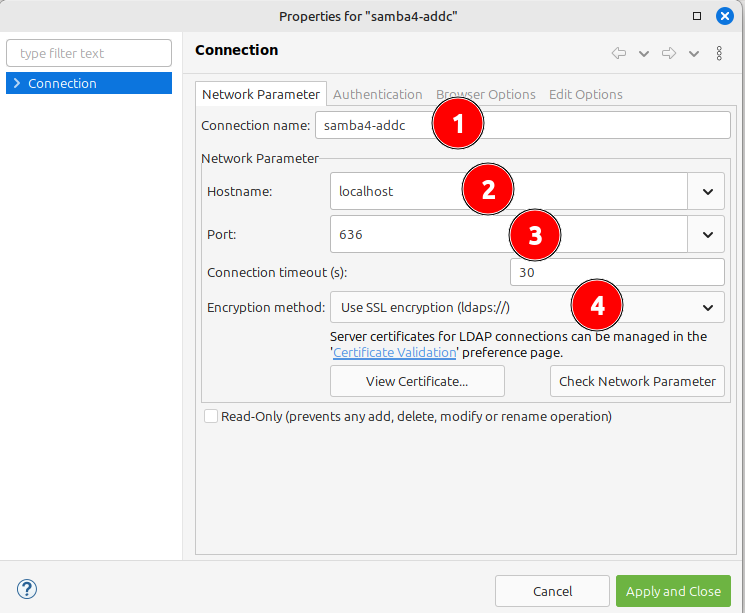
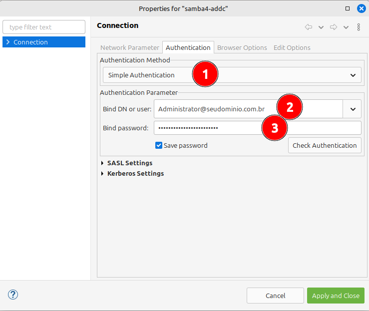
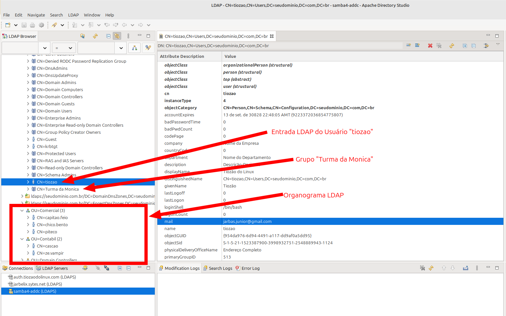

# Active Directory Domain Controller with Samba4.
```
 ____________________________________________________________________________
/\                                                                           \
\_|                 Active Directory Domain Controler - ADDC                 |
  |                             Linux with Samba4                            |
  |   _______________________________________________________________________|_
   \_/_________________________________________________________________________/

```
To create a Docker image with Samba4 acting as an Active Directory Domain Controller (AD DC), the choice of base image directly influences the ease of installation, community support, and image maintenance.

Let's look at some options and their pros and cons:

## ✅ 1. Debian
* Pros:
    * Samba is well supported on Debian, with up-to-date packages.
    * Samba community documentation often has examples for Debian.
    * Stable, predictable, and widely used in production environments.
    * The *debian:trixie-slim* image size is relatively small.
* Cons:
    * Some packages may be slightly out of date compared to upstream
    * Version **Version 4.22.3-Debian-4.22.3+dfsg-4**
* Alternative:
    * Use the *debian:trixie-backports* image which has the most up-to-date samba version.
    * Version **Version 4.22.4-Debian-4.22.4+dfsg-1~deb13u1**

## ✅ 2. Ubuntu
* Pros:
    * Based on Debian, with generally newer packages in LTS versions.
    * Good documentation and an active community.
    * Ubuntu version: 20.04 or 22.04 LTS is an excellent stable base.
* Cons:
    * The image is slightly larger than the Debian one.
    * May have more layers of complexity than systemd, depending on what you need to run.
    * Version **4.15.13-Ubuntu**

## ✅ 3. Fedora 42 (recomended)
* Pros:
    * Usually more up-to-date (closer to upstream).
    * Good for testing or environments where you want to explore recent features.
    * Version **4.22.4**
* Cons:
    * Fedora isn't as common on production servers.
    * Frequent updates (shorter lifecycle)
    * It may be harder to find tutorials or ready-made examples focused on this use case.
    * Larger and heavier image for builds.

## 🎯 Conclusion:

* If your goal is stability, documentation compatibility, and fewer headaches, `Debian` is the best choice.
* If you're already more comfortable with `Ubuntu`, especially on servers, it's also a great base.
* If you need the latest features (2019 level) of Samba4, use `Fedora`.

## 🚀 How to run?

### Clone the repository

```bash
git clone https://github.com/Tiozao-do-Linux/samba4-addc.git

# enter the directory
cd samba4-addc/fedora

# copy the env.example file to .env
cp ../env.example .env
```

### Configure your Active Directory domain and password

> [!TIP]
> The `.env` file should contain some basic variables that can be changed according to your needs.
> 
> Example: See my case where my login domain is **tiozaodolinux** and my REALM is **tiozaodolinux.com**. See what my **.env** looks like below:

```bash
_REALM="TIOZAODOLINUX.COM"
_SYSVOL="tiozaodolinux.com"
_DOMAIN="TIOZAODOLINUX"
_PASSWORD="SuperSecretPassword@2025"
_NETBIOS="dc01"
_DNS_FORWARDER_1="1.1.1.1"
_DNS_FORWARDER_2="8.8.8.8"
_DNS_BACKEND="SAMBA_INTERNAL"
_TEMP_PASSWORD="TempSuperSecretPassword@2025"

# Some default settings:
#################################
_SAMBA_CONF_DIR="/etc/samba"
_SAMBA_LIB_DIR="/var/lib/samba"
_SAMBA_LOG_DIR="/var/log/samba"
_PROVISION_DIR="/root/provision"
```

### Run the container

```bash
docker compose up -d
```

### See the logs
```bash
docker compose logs -f
```

### List running containers
```bash
docker compose ps
```

### List samba related volumes
```bash
docker volume ls | grep samba
```

### Accessing the container shell

```bash
docker exec -it samba4-ad bash
```

> [!WARNING]
> 
> When it is necessary to execute commands **inside** the container
> 
> Note that the prompt changes to **`[root@dc01 /]`**
> 
```bash
[root@dc01 /]# cat /etc/samba/smb.conf
# Global parameters
[global]
	ad dc functional level = 2016
	dns forwarder = 1.1.1.1 8.8.8.8
	netbios name = DC01
	realm = SEUDOMINIO.COM.BR
	server role = active directory domain controller
	template shell = /bin/bash
	workgroup = SEUDOMINIO
	idmap_ldb:use rfc2307 = yes

[sysvol]
	path = /var/lib/samba/sysvol
	read only = No

[netlogon]
	path = /var/lib/samba/sysvol/seudominio.com.br/scripts
	read only = No

[root@dc01 /]# nmap localhost
Starting Nmap 7.92 ( https://nmap.org ) at 2025-06-18 23:37 UTC
Nmap scan report for localhost (127.0.0.1)
Host is up (0.000011s latency).
Other addresses for localhost (not scanned): ::1
Not shown: 987 closed tcp ports (reset)
PORT      STATE SERVICE
53/tcp    open  domain
88/tcp    open  kerberos-sec
135/tcp   open  msrpc
139/tcp   open  netbios-ssn
389/tcp   open  ldap
445/tcp   open  microsoft-ds
464/tcp   open  kpasswd5
636/tcp   open  ldapssl
3268/tcp  open  globalcatLDAP
3269/tcp  open  globalcatLDAPssl
49152/tcp open  unknown
49153/tcp open  unknown
49154/tcp open  unknown

Nmap done: 1 IP address (1 host up) scanned in 0.19 second
```

### Populating the domain with fake users

> [!IMPORTANT]
> After the initial samba4 provisioning, the **`post-provision.sh`** script processes the **ldif** files before starting samba. This automatically happens before the container finishes starting.
> 
> I'm leaving as a gift an ldif with 1000 fake users for the domain **SEUDOMINIO**.
>
> Don't know how to generate a custom LDIF?

> See this article I wrote on my wiki: https://wiki.tiozaodolinux.com/Guide-for-Linux/Samba-Active-Directory-Docker-Container


## Graphically viewing LDAP

> [!TIP]
> One way to view LDAP without having to access the container is to install Apache Directory Studio (https://directory.apache.org/studio/) which is an excellent LDAP BROWSER
> 
> Browser LDAP Apache Directory Studio via flatpak - https://flathub.org/apps/org.apache.directory.studio
> 
> ### Configuration and Visualization
> 
> 
> 
> 
> 

## Remove everything from your environment

> [!WARNING]
> If something went wrong and didn't work as expected and you want to remove the container, image and volumes from your local environment

```bash
docker stop samba4-ad; \
docker rm samba4-ad; \
docker volume rm $( docker volume ls -q | grep samba ); \
docker rmi jarbelix/samba4-addc-fedora; 
```

## Hub do Jarbelix
* https://hub.docker.com/u/jarbelix

## Useful links for deployment

* Dockerfile reference - https://docs.docker.com/reference/dockerfile/
* Docker Best Pratices - https://docs.docker.com/build/building/best-practices/
* Build context - https://docs.docker.com/build/concepts/context/
* Choosing RUN, CMD and ENTRYPOINT - https://www.docker.com/blog/docker-best-practices-choosing-between-run-cmd-and-entrypoint/
* Using Tags and Labels to Manage Docker Image Sprawl - https://www.docker.com/blog/docker-best-practices-using-tags-and-labels-to-manage-docker-image-sprawl/
* CI/CD pipeline - https://github.com/marketplace/actions/docker-build-push-action

## If you want to know more about Samba4, access the documentation I made available:
* https://wiki.tiozaodolinux.com/Guide-for-Linux/Active-Directory-With-Samba-4#primeiro-dc-dc01

## Other Samba4 and Docker initiatives

* https://github.com/diegogslomp/samba-ad-dc
* https://github.com/Fmstrat/samba-domain - https://vinaysit.wordpress.com/2023/01/03/containerized-samba-active-directory-domain-controller-with-efk-stack/
* https://github.com/bodsch/docker-samba4
* https://github.com/dperson/samba
* https://github.com/tkaefer/alpine-samba-ad-container
* https://helgeklein.com/blog/samba-active-directory-in-a-docker-container-installation-guide/ - A real lesson
* https://github.com/instantlinux/docker-tools/tree/main/images/samba-dc (Very interesting and active)
* https://github.com/diegogslomp/samba-ad-dc (Various flavors: almalinux, debian, rocklinux, ubuntu)

