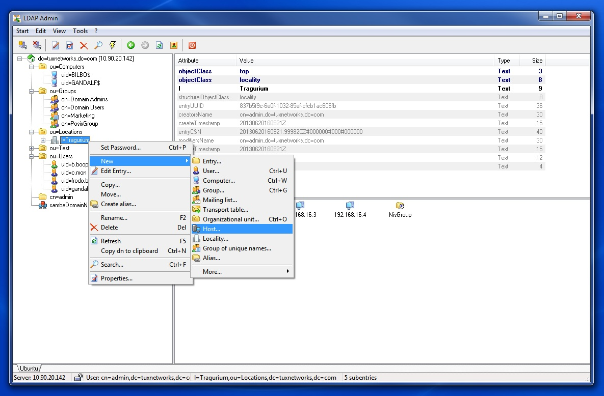

# Active Directory Domain Controller com Samba4.
```
 ____________________________________________________________________________
/\                                                                           \
\_|                 Active Directory Domain Controler - ADDC                 |
  |                             Linux com Samba4                             |
  |   _______________________________________________________________________|_
   \_/_________________________________________________________________________/

```
Tá em dúvida se deve utilizar como base uma imagem do Ubuntu ou do Debian ou do Fedora 42

Para criar uma imagem Docker com Samba4 atuando como um Active Directory Domain Controller (AD DC), a escolha da imagem base influencia diretamente na facilidade de instalação, suporte da comunidade e manutenção da imagem.

Vamos analisar algumas das suas opções:

## ✅ 1. Debian
* Prós:
    * Samba é bem suportado no Debian, com pacotes atualizados.
    * Documentação da comunidade Samba costuma ter exemplos com Debian.
    * Estável, previsível e amplamente utilizado em ambientes de produção.
    * Tamanho da imagem debian:bullseye-slim ou bookworm-slim é relativamente enxuto.
* Contras:
    * Alguns pacotes podem estar um pouco desatualizados em relação ao upstream (embora normalmente estáveis para uso em produção).

## ✅ 2. Ubuntu
* Prós:
    * Baseado no Debian, com pacotes mais recentes em versões LTS.
    * Boa documentação e comunidade ativa.
    * Versão ubuntu:20.04 ou 22.04 LTS é uma excelente base estável.
* Contras:
    * A imagem é um pouco maior que a do Debian.
    * Pode ter mais camadas de complexidade em relação ao systemd, dependendo do que você precisa rodar.

## ✅ 3. Fedora 42  (recomendado)
* Prós:
    * Costuma estar mais atualizado (mais próximo do upstream). Hoje, 18/Jun/2025 a versão do samba instalada é 4.22.2 que corresponde com a última release oficial.
    * Bom para testes ou ambientes onde se quer explorar funcionalidades recentes.
* Contras:
    * Fedora não é tão comum em servidores de produção.
    * Atualizações frequentes (ciclo de vida mais curto), embora possa ser atualizado entre versões facilmente
    * Pode ser mais difícil encontrar tutoriais ou exemplos prontos focados nesse uso.
    * Imagem maior e mais “pesada” para builds.

## 🎯 Conclusão:
* Se o objetivo é estabilidade, compatibilidade com documentação e menor dor de cabeça, `Debian` é a melhor escolha.
* Se você já está mais confortável com `Ubuntu`, especialmente em servidores, ele também é uma ótima base.
* Use `Fedora` apenas se você precisa testar recursos muito recentes do Samba.

## 🚀 Como rodar?

> [!NOTE]
> Um git clone básicão

### Clonar o repositório

```bash
git clone https://github.com/Tiozao-do-Linux/samba4-addc.git

# entrar no diretório
cd samba4-addc

# copiar o arquivo .env.example para .env
cp .env.example .env
```

### Configurar o seu domínio e senha do Active Directory

> [!TIP]
> O arquivo `.env.example` contém algumas variáveis básicas que podem ser alteradas de acordo com suas necessidades.

```bash
_REALM="SEUDOMINIO.COM.BR"
_SYSVOL="seudominio.com.br"
_DOMAIN="SEUDOMINIO"
_PASSWORD="SuperSecretPassword@2025"
_NETBIOS="dc01"
_TEMP_PASSWORD="TempSuperSecretPassword@2025"
_DNS_FORWARDER_1="1.1.1.1"
_DNS_FORWARDER_2="8.8.8.8"
_DNS_BACKEND="SAMBA_INTERNAL"
```

### Executar o container (deploy) fedora

> [!TIP]
> Recomendado por ter o samba mais atualizado

```bash
docker compose up -d
```

### Ver logs
```bash
docker compose logs -f
```

### Listar os containers em execução
```bash
docker compose ps
```

### Listar os volumes
```bash
docker volume ls | grep samba
```

### Entrar no container

```bash
docker exec -it samba4-ad bash
```

> [!WARNING]
> 
> Quando se fizer necessário executar comandos **dentro** do container
> 
> Note que o prompt muda para **`[root@dc01 /]`**
> 
```bash
[root@dc01 /]# cat /etc/samba/smb.conf
# Global parameters
[global]
	ad dc functional level = 2016
	dns forwarder = 1.1.1.1 8.8.8.8
	netbios name = DC01
	realm = SEUDOMINIO.COM.BR
	server role = active directory domain controller
	template shell = /bin/bash
	workgroup = SEUDOMINIO
	idmap_ldb:use rfc2307 = yes

[sysvol]
	path = /var/lib/samba/sysvol
	read only = No

[netlogon]
	path = /var/lib/samba/sysvol/seudominio.com.br/scripts
	read only = No

[root@dc01 /]# nmap localhost
Starting Nmap 7.92 ( https://nmap.org ) at 2025-06-18 23:37 UTC
Nmap scan report for localhost (127.0.0.1)
Host is up (0.000011s latency).
Other addresses for localhost (not scanned): ::1
Not shown: 987 closed tcp ports (reset)
PORT      STATE SERVICE
53/tcp    open  domain
88/tcp    open  kerberos-sec
135/tcp   open  msrpc
139/tcp   open  netbios-ssn
389/tcp   open  ldap
445/tcp   open  microsoft-ds
464/tcp   open  kpasswd5
636/tcp   open  ldapssl
3268/tcp  open  globalcatLDAP
3269/tcp  open  globalcatLDAPssl
49152/tcp open  unknown
49153/tcp open  unknown
49154/tcp open  unknown

Nmap done: 1 IP address (1 host up) scanned in 0.19 second
```

## Configurações do domínio (opcional)

> [!WARNING]
> O script de pós configuração (**`/provision/post-provision.sh`**) é executado logo após o provisionamento inicial do container.
>
> Ficou cuioso? **Faça um cat no referido arquivo.**
> 
> Isso permite ajustar as configurações padrões do samba para as suas necessidades, bastando alterar o arquivo antes de iniciar o container.
> 
> Veja abaixo um *gostinho* do que é possível fazer via **samba-tool**
> 
> Tenha certeza que está dentro do container visualizando o prompt **`[root@dc01 /]`**

```bash
# Criar grupo de usuários
samba-tool group add 'Turma da Monica' --description "Grupo de Usuários da Turma da Mônica"

# Criando OUs
samba-tool ou add 'OU=Presidente'
samba-tool ou add 'OU=Financeiro'
samba-tool ou add 'OU=RH'
samba-tool ou add 'OU=TI'
samba-tool ou add 'OU=Contabil'
samba-tool ou add 'OU=Producao'
samba-tool ou add 'OU=Comercial'
samba-tool ou add 'OU=Logistica'

# Criando os usuários em suas OUs
samba-tool user add seu.cebola          --random-password --use-username-as-cn --userou='OU=Presidente'

samba-tool user add cebolinha           --random-password --use-username-as-cn --userou='OU=Financeiro'
samba-tool user add anjinho             --random-password --use-username-as-cn --userou='OU=Financeiro'

samba-tool user add monica              --random-password --use-username-as-cn --userou='OU=RH'
samba-tool user add dudu                --random-password --use-username-as-cn --userou='OU=RH'
samba-tool user add rolo                --random-password --use-username-as-cn --userou='OU=RH'

samba-tool user add xaveco              --random-password --use-username-as-cn --userou='OU=TI'
samba-tool user add horacio             --random-password --use-username-as-cn --userou='OU=TI'
samba-tool user add marina              --random-password --use-username-as-cn --userou='OU=TI'

samba-tool user add cascao              --random-password --use-username-as-cn --userou='OU=Contabil'
samba-tool user add ze.vampir           --random-password --use-username-as-cn --userou='OU=Contabil'

samba-tool user add magali              --random-password --use-username-as-cn --userou='OU=Producao'
samba-tool user add rosinha             --random-password --use-username-as-cn --userou='OU=Producao'
samba-tool user add carminha.frufru     --random-password --use-username-as-cn --userou='OU=Producao'

samba-tool user add chico.bento         --random-password --use-username-as-cn --userou='OU=Comercial'
samba-tool user add capitao.feio        --random-password --use-username-as-cn --userou='OU=Comercial'
samba-tool user add piteco              --random-password --use-username-as-cn --userou='OU=Comercial'

samba-tool user add franjinha           --random-password --use-username-as-cn --userou='OU=Logistica'
samba-tool user add rita.najura         --random-password --use-username-as-cn --userou='OU=Logistica'
samba-tool user add juca                --random-password --use-username-as-cn --userou='OU=Logistica'

# Adicionando usuários aos Grupos
samba-tool group addmembers 'Turma da Monica' monica,cebolinha,cascao,magali

samba-tool group addmembers 'Turma da Monica' seu.cebola,anjinho,dudu,rolo,xaveco,horacio,marina,ze.vampir,rosinha,carminha.frufru,chico.bento,capitao.feio,piteco,franjinha,rita.najura,juca

# Listando os Grupos e Membros de Grupos
samba-tool group list

samba-tool group listmembers 'Turma da Monica'

# Listando as OUs e Objetos da OU
samba-tool ou list

samba-tool ou listobjects OU=Financeiro

# Listando propriedades de um usuário
samba-tool user show monica

# Trocar a senha do usuário monica que foi criado com senha aleatória para ${_PASSWORD}
samba-tool user setpassword monica --newpassword=${_PASSWORD}

# Listando todos usuários do domínio
samba-tool user list
```

## Visualiando Graficamente o LDAP

> [!TIP]
> Uma das formas de se visualizar o LDAP sem ter que acessar o container é instalar o Apache Directory Studio (https://directory.apache.org/studio/) que é um excelente **BROWSER** de LDAP.
> 
> No Windows é super simples de instalar (next, next, finish).
> 
> No Linux Desktop é mais fácil ainda, tem no **Gerenciador de Pacotes** a versão Flatpack(Flathub).
> 
> ### Configuração e Visualização
> 
> 
> 
> 
> 

> [!TIP]
> Uma outra forma de visualizar o LDAP é através do **LDAP Admin** disponível no site (http://www.ldapadmin.org/) que aparentemente está abandonado desde 2012, mas ainda está disponível no https://sourceforge.net/projects/ldapadmin/
> 
> 


## Remover TUDO do seu ambiente

> [!WARNING]
> Se algo deu errado e não funcionou como esperado e quiser remover o container, imagem e volumes de seu ambiente local

```bash
docker stop samba4-ad
docker rm samba4-ad
docker rmi jarbelix/samba4-addc-fedora
docker volume rm $( docker volume ls -q | grep samba )
```

## Hub do Jarbelix
* https://hub.docker.com/u/jarbelix

## Se quiser criar imagens locais (buildar)

```bash
docker build -t samba-dc-fedora --no-cache .

docker build -t samba-dc-debian --no-cache debian

docker build -t samba-dc-ubuntu --no-cache ubuntu
```

## Listar imagens criadas localmente
```bash
docker images

REPOSITORY              TAG             IMAGE ID       CREATED          SIZE
samba-dc-ubuntu         latest          085b45ae4f5c   2 minutes ago    319MB
samba-dc-debian         latest          3bdfb72696e3   3 minutes ago    364MB
samba-dc-fedora         latest          b0bf28b7c145   11 minutes ago   564MB
```

## Links Úteis pra deploy

* Dockerfile reference - https://docs.docker.com/reference/dockerfile/
* Docker Best Pratices - https://docs.docker.com/build/building/best-practices/
* Choosing RUN, CMD and ENTRYPOINT - https://www.docker.com/blog/docker-best-practices-choosing-between-run-cmd-and-entrypoint/
* CI/CD pipeline - https://github.com/marketplace/actions/docker-build-push-action

## Desejando conhecer mais sobre Samba4, acesse a documentação que disponibilizei:
* https://wiki.tiozaodolinux.com/Guide-for-Linux/Active-Directory-With-Samba-4#primeiro-dc-dc01

## Outras iniciativas de Samba4 e Docker

Pesquisando na internet sobre, achei algumas outras referências:
* https://github.com/bodsch/docker-samba4
* https://github.com/dperson/samba
* https://github.com/tkaefer/alpine-samba-ad-container
* https://helgeklein.com/blog/samba-active-directory-in-a-docker-container-installation-guide/
* https://github.com/instantlinux/docker-tools/tree/main/images/samba-dc (Bem interessante e ativo)
* https://github.com/diegogslomp/samba-ad-dc (Vários sabores: almalinux, debian, rocklinux, ubuntu)

